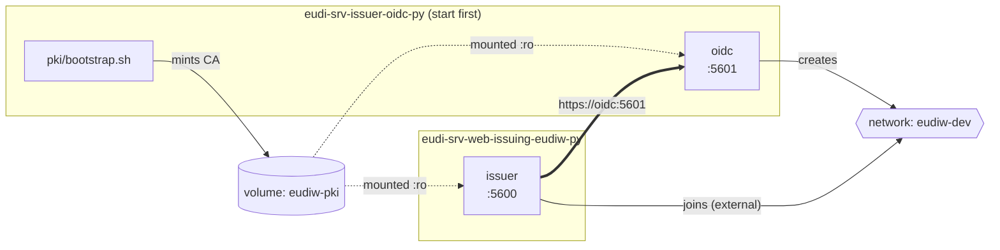

# Local development with Docker: PID issuer

Runs the issuer as a container over HTTPS, with certificate verification switched
**on**. No virtualenv, no `sudo`, no `certbot`, nothing written outside this
checkout.

The issuer needs the OIDC authorization server, which lives in its own
repository (`eudi-srv-issuer-oidc-py`) and has its own `DOCKER.md`. **Start that
one first**. It creates the Docker network and the development CA that both
stacks share. Running `docker compose up` here without it fails with
`network eudiw-dev not found`, which is the intended signal rather than a
silently half-working stack.

## Quick start

In the authorization server repository:

```sh
./pki/bootstrap.sh     # once; mints the CA both services trust
docker compose up -d
```

Then here:

```sh
./pki/bootstrap.sh   # once; lays out the document-signing material
docker compose up --build
```

Verify, using the CA certificate from the authorization server checkout:

```sh
curl --cacert /path/to/eudi-srv-issuer-oidc-py/pki/out/ca.crt \
  https://localhost:5600/.well-known/openid-credential-issuer
```

No `-k`. If that returns JSON, TLS is verifying properly.

| Service | URL |
| --- | --- |
| Issuer | <https://localhost:5600> |
| Authorization server | <https://localhost:5601> |

Importing the root certificate into your OS keychain (see the authorization
server's `DOCKER.md`) makes browsers accept both without a warning.

## Two certificate chains, not one

Conflating these is the usual source of confusion here, so they are kept apart:

| | TLS | Document signing |
| --- | --- | --- |
| Answers | who the server is on the wire | who signed the credential |
| Comes from | `pki/bootstrap.sh` in the authz server repo | `pki/bootstrap.sh` here |
| Lives in | the `eudiw-pki` Docker volume | `pki/out/eudiw/` |
| Mounted at | `/etc/eudiw/tls` | `/etc/eudiw/pid-issuer-dev` |
| Material | generated root + per-service leaves | EU reference test PKI (IACA + PID-DS-0002) |

This repo's `pki/bootstrap.sh` unpacks the document-signing material from
`api_docs/test_tokens/`, which upstream commits. It is test material and only
works against test wallets, so no real key is generated or needed.

The VM's `run-issuer.sh` sets `REQUESTS_CA_BUNDLE` to `iaca.pem`,
which is a *document-signing* CA, not a TLS one. That mismatch is a good part of
why TLS misbehaves there and why so many outbound calls carry `verify=False`.

## How the two stacks connect



Each repository is its own Compose project. They share exactly two named things,
a network and a volume, which is what lets them be cloned into unrelated
directories with no relative paths between them.

The issuer reaches the authorization server two different ways, on purpose:

| From | URL | Used for |
| --- | --- | --- |
| this container | `https://oidc:5601` | `/introspection`, `/verify/user`, preauth |
| the wallet or browser | `https://localhost:5601` | the OAuth redirect flow |

The dev CA issues that service's certificate with subject alternative names for
**both**, so neither path needs verification disabled. The application already
preferred an `internal_url` over `base_url`
([`app/route_oidc.py:295`](app/route_oidc.py)). The key had simply never been
set, so both paths used the public URL. Inside a container that means the issuer
dials its own localhost.

## Configuration

`docker/config.yaml.template` is a template, not the file the application reads.
At container start `docker/entrypoint.sh` runs `envsubst` over it and writes the
result to the path the application actually loads:

| In the container | What |
| --- | --- |
| `/tmp/config.yaml.template` | the template, mounted read-only from `docker/` |
| `/config.yaml` | the rendered config: real URLs, what the app reads |

Two files because the mount is read-only, so the rendered output cannot overwrite
it. That is deliberate: your file on disk is never modified and stays a clean
template.

The substitution is needed because the application's config loader is a plain
`yaml.safe_load()` and does no variable expansion
([`app/__init__.py:84`](app/__init__.py)). It would read `"${ISSUER_PUBLIC_URL}"`
as a literal string and publish that as its own address. A placeholder left
unsubstituted stops startup rather than serving broken metadata.

Only five values are templated, all of them URLs that differ between a laptop and
a deployed host:

| Variable | Locally | Purpose |
| --- | --- | --- |
| `ISSUER_PUBLIC_URL` | `https://localhost:5600` | what the wallet dials |
| `OIDC_PUBLIC_URL` | `https://localhost:5601` | the OAuth redirect target |
| `OIDC_INTERNAL_URL` | `https://oidc:5601` | server-to-server, over the shared network |
| `FRONTEND_PUBLIC_URL` | `https://localhost:5602` | not yet in this stack |
| `STATUSLIST_PUBLIC_URL` | `https://localhost:5603` | not yet in this stack |

Everything else in those ~215 lines (credential definitions, countries, key
paths, expiry times) is identical in every environment and stays literal.

Two levels of substitution are at work. Compose
expands `${ISSUER_PORT:-5600}` on the host, reading `.env`; `envsubst` then
expands `${ISSUER_PUBLIC_URL}` inside the container. So the chain is
`.env` → compose → container environment → `envsubst` → `/config.yaml`.

Ports and other settings come from `.env`. Copy `.env.example` if you need to
change something. Every value has a working default.

The entrypoint also rewrites the issuer URL inside `app/metadata_config/*.json`,
which hardcode it in 22 places. That happens on the image's copy inside the
container, so the tracked files are never touched and `git status` stays clean.
On the VM the same job is done by `scripts/setup-issuer-metadata.sh`, which
`git restore`s and then `sed -i`s the real files.

## Day to day

```sh
docker compose up -d              # start
docker compose logs -f issuer     # follow logs
docker compose restart issuer     # after changing config
docker compose up -d --build      # after changing requirements.txt
docker compose down               # stop
```

`app/` is bind-mounted, so ordinary code edits are picked up by the Flask
reloader without a rebuild.

## Two compose files in this repo

Upstream ships `docker-compose.yml`, which pulls the published `ghcr.io` image
and bind-mounts `/etc/eudiw` from the host. It is untouched and still works:

```sh
docker compose -f docker-compose.yml up
```

Compose prefers `compose.yaml`, so a bare `docker compose up` runs the local
development stack instead. With both files present Compose prints
`Found multiple config files with supported names` on every command, followed by
the one it chose. That warning is noise rather than a problem.

## Troubleshooting

**`network eudiw-dev not found`**. The authorization server stack is not
running. Start it first.

**`unsubstituted variables remain`**. A variable used by the config template is
missing from the environment. The entrypoint prints which ones.

**`credential_encryption_key must be a P-256 EC private key`**. That key is the
wrong type. Delete `pki/out/eudiw/privKey/credential_request.pem` and re-run
`./pki/bootstrap.sh`.

**Certificate errors after regenerating the CA**. The leaves changed but running
containers still hold the old ones. `docker compose restart` in both repositories.
